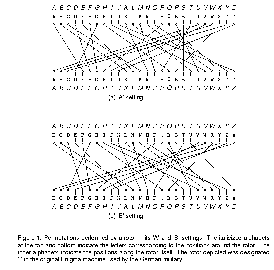
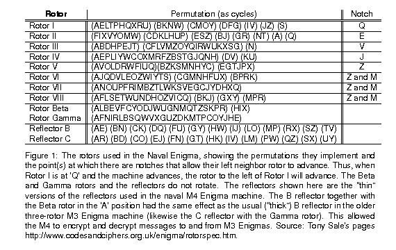

# The-Enigma-Machine
You may have heard of the Enigma machines that Germany used during World War II to encrypt its military communications.
This project involves building a simulator for a generalized version of this machine (which itself had several different versions.) The program will take descriptions of possible initial configurations of the machine and messages to encode or decode (the Enigma algorithms were reciprocal, meaning that encryption is its own inverse operation.)

## Running the program
To run your program, you can use the command

java enigma.Main [configuration file] [input file] [output file]

### Example configuration file 
```
  ABCDEFGHIJKLMNOPQRSTUVWXYZ
  5 3
  I MQ      (AELTPHQXRU) (BKNW) (CMOY) (DFG) (IV) (JZ) (S)
  II ME     (FIXVYOMW) (CDKLHUP) (ESZ) (BJ) (GR) (NT) (A) (Q)
  III MV    (ABDHPEJT) (CFLVMZOYQIRWUKXSG) (N)
  IV MJ     (AEPLIYWCOXMRFZBSTGJQNH) (DV) (KU)
  V MZ      (AVOLDRWFIUQ)(BZKSMNHYC) (EGTJPX)
  VI MZM    (AJQDVLEOZWIYTS) (CGMNHFUX) (BPRK)
  VII MZM   (ANOUPFRIMBZTLWKSVEGCJYDHXQ)
  VIII MZM  (AFLSETWUNDHOZVICQ) (BKJ) (GXY) (MPR)
  Beta N    (ALBEVFCYODJWUGNMQTZSKPR) (HIX)
  Gamma N   (AFNIRLBSQWVXGUZDKMTPCOYJHE)
  B R       (AE) (BN) (CK) (DQ) (FU) (GY) (HW) (IJ) (LO) (MP)
            (RX) (SZ) (TV)
  C R       (AR) (BD) (CO) (EJ) (FN) (GT) (HK) (IV) (LM) (PW)
            (QZ) (SX) (UY)
```

### Example settings line
```
* B BETA III IV I AXLE (YF) (ZH)
```

## Description of the Machine
The Enigmas effect a substitution cipher, on the letters of a message. That is, at any given time, the machine performs a permutation---a one-to-one mapping---of the alphabet onto itself. The alphabet consists solely of the 26 letters in one case (there were various conventions for spaces and punctuation

Plain substitution ciphers are easy to break (you've probably seen puzzles in newspapers that consist of breaking such ciphers). The Enigma, however, implements a progressive substitution, different for each subsequent letter of the message. This made decryption considerably more difficult.

The device consists of a simple mechanical system of (partially) interchangeable rotors (Walzen) that sit side-by-side on a shaft and make electrical contact with each other. Most of these rotors have 26 contacts on both sides, which are wired together internally so as to effect a permutation of signals coming in from one side onto the contacts on the other (and the inverse permutation when going in the reverse direction). To the left of the rotors, one could select one of a set of reflectors (Umkehrwalzen), with contacts on their right sides only, and wired to connect half of those contacts to the other half. A signal starting from the right through one of the 26 possible contacts will flow through wires in the rotors, "bounce" off the reflector, and then come back through the same rotors (in reverse) by a different route, always ending up permuted to a letter position different from where it started. (This was a significant cryptographic weakness, as it turned out. It doesn't really do a would-be code-breaker any good to know that some letters in an encrypted message might be the same as the those in the plaintext if he doesn't know which ones. But it does a great deal of good to be able to eliminate possible decryptions because some of their letters are the same as in the plaintext.)

Each rotor and each reflector implements a different permutation, and the overall effect depends on their configuration: which rotors and reflector are used, what order they are placed in the machine, and which rotational position they are initially set to. This configuration is the first part of the secret key used to encrypt or decrypt a message. In what follows, we'll refer to the selected rotors in a machine's configuration as 1–N, with 1 being the reflector, and N the rightmost rotor. In our simulator, N will be a configuration parameter. In actual Enigma machines, it was fixed for any given model (the Navy used four and the Wehrmacht used three.)

The overall permutation changes with each successive letter because some of the rotors rotate after encrypting a letter. Each rotor has a circular ratchet on its right side and a an "alphabet ring" (Ringstellung) on its left side that fits over the ratchet of the rotor to its left. Before a letter of a message is translated, a spring-loaded pawl (lever), one to the right of each rotating rotor, tries to engage the ratchet on the right side of its rotor and thus rotate that rotor by one position, changing the permutation performed by the rotor. The lever on the rightmost rotor (N) always succeeds, so that rotor N (the "fast" rotor) rotates one position before each character. The pawls pushing the other rotors, however, are normally blocked from engaging their rotors by the ring on the left side of the rotor to their right.

This ring usually holds the pawl away from its ratchet, preventing the rotor wheel to its left from moving. However, the rings have notches in them (either one or two in the original Enigma machines), and when the pawl is positioned over a notch in the ring for the rotor to its right, it slips through to its own rotor and pushes it forward. A "feature" of the design called "double stepping" (corrected in other versions of the Enigma, since it reduced the period of the cipher) is that when a pawl is in a notch, it also moves the notch itself and the rotor the notch is connected to, so that the rotors on both sides of the pawl move.


The effect of advancing a wheel is to change where on the wheel any given signal enters or leaves. When a wheel is in its 'A' setting in the machine, then a signal that arrives from the right at, say, the 'C' position, goes into the 'C' contact on the wheel. Likewise, a signal that leaves the wheel from its left 'C' contact exits at the 'C' position. When the wheel is rotated by one to its 'B' setting, a signal that arrives at the 'C' position goes instead into the 'D' contact on the wheel, and a signal that leaves through the 'D' contact does so at the 'C' position. It's easier to calculate if we use numbers 0—25 rather than letters ('A' is 0, 'B' is 1, etc.). Then, when the wheel is in its kk setting, a signal entering at the pp position enters the p+kmod26p+kmod26 contact on the wheel, and a signal exiting through the cc contact does so at the c−kmod26c−kmod26 position. For example, Figure 1 shows one of the rotors from the real Enigma machines (called rotor "I") and the effect of moving from its 'A' to its 'B' setting.



The contacts on the rightmost rotor's right side connect with stationary input and output contacts, which run to keys that, when pressed, direct current to the contact from a battery or, when not pressed, direct current back from the contact to a light bulb indicating a letter of the alphabet. Since a letter never encrypts or decrypts to itself after going back and forth through the rotors, the to and from directions never conflict.

The German Navy used a machine with 12 rotors and five slots for them:

Eight rotors labeled with roman numerals I—VIII, of which three will be used in any given configuration as the rightmost rotors,
Two additional non-moving rotors (Zusatzwalzen) labeled "Beta" and "Gamma", of which one will be used in any configuration, as the fourth-from-right rotor, and
Two reflectors (Umkehrwalzen), labeled 'B' and 'C', of which one will be used in any given configuration as the leftmost rotor.
Given just this equipment, there are 614,175,744 possible configurations (or keys):

Two possible reflectors, times
Two possible rotors in the fourth position, times
8!/(8−3)!=3368!/(8−3)!=336 choices for the rightmost three rotors and their ordering, times
264264 possible initial rotational settings for the rightmost four rotors (each reflector had only one possible position.).
Especially by today's standards, this is not a large key size (less than 30 bits). To make things more difficult for code-breakers, therefore, the Enigma incorporated a plugboard (Steckerbrett) between the keyboard and the rightmost wheel. It acted as a non-moving, configurable rotor. The operator could choose any set of disjoint pairs of letters by means cables placed between them on the plugboard. Each selected pair would then be swapped going into the machine from the keyboard and coming out into the indicator lights. Thus, if the operator connected ("steckered") the letters A and P, then P would be substituted for each A typed and vice versa. Likewise, if an ingoing letter was encrypted to P by the other rotors, it would display as A, and letters decrypted as A would display as P.


## Describing permutations

Since the rotors and the plugboard implement permutations, we'll need a standard way to describe them. We could simply have a table showing each letter and what it maps to, but we'll use a more compact notation known as cycle representation. The idea is that any permutation of a set may be described as a set of cyclic permutations. For example, the notation

(AELTPHQXRU) (BKNW) (CMOY) (DFG) (IV) (JZ) (S)
describes the permutation in Figure 1. It describes seven cycles:

* A maps to E, E to L, L to T, ..., R to U, and U back to A.
* B maps to K, K to N, N to W, and W back to B.
* C maps to M, M to O, O to Y, and Y back to C.
* D maps to F, F to G, and G back to D.
* I maps to V and V back to I.
* J maps to Z and Z back to J.
* S maps to itself.
The inverse permutation just reverses these cycles:

* U maps to R, R to X, ..., E to A, and A back to U.
* ...
* S maps to itself.
Each letter appears in one and only one cycle, so the mapping is unambiguous. As a shorthand, we'll say that if a letter is left out of all cycles, it maps to itself (so that we could have left off "(S)" In the example above.)

Figure 2 shows the permutations corresponding to the rotors used in the German Navy's Enigma machine.


